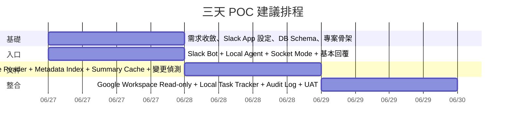

# Slack-based Local AI Ops Agent 三天 POC 分析與執行報告

修正版題目（中文）：請針對「以 Slack 為入口的本機 AI 工作代理 POC（Slack-based Local AI Ops Agent POC）」進行深度研究，並以**三天內可完成**為首要前提，將其他不適合在三天內完成的項目整理到備註或未來規劃。完成分析後，請進一步規劃可依序開發的 POC phases，以及每個 phase 的驗收標準，並以**繁體中文**產出一份正式的分析與執行報告。  

Corrected English question: Please conduct deep research on a **Slack-based Local AI Ops Agent POC**, with the primary focus on what can realistically be delivered within **three days**. Put everything else into notes or future plans. After the analysis, create sequential POC development phases and define acceptance criteria for each phase. Please produce a formal analysis and execution report in **Traditional Chinese**.

## 執行摘要

根據你提供的需求說明，這個專案的核心不是在三天內做出完整平台，而是驗證一條明確且有價值的工作流：**使用者透過 Slack 與本機啟動的 Local Agent 互動，查詢本機文件與 Google Workspace 文件、產生摘要、建立個人任務，並留下可追蹤的操作紀錄**。這個定位非常適合做成三天 POC，因為它能在有限時間內驗證三件最重要的事：Slack 是否真的能成為工作入口、Local Agent 是否能安全穩定地操作本機資源、以及 AI Orchestrator 是否能在受控工具邊界內提供實用價值。你的上傳文件也已明確把 Local-first、read-only、human-in-the-loop、server-ready 列為原則，這與三天 POC 的成功條件高度一致。fileciteturn0file0

我建議的三天 POC 版本，應採用 **Local Agent + Slack Socket Mode + Node.js/TypeScript + Slack Bolt for JavaScript + SQLite + 雲端 LLM API** 的組合。Slack 官方文件指出，Socket Mode 可在**不暴露公網 HTTP Request URL** 的前提下接收 Events API 與互動事件，並且 Slack 也明確建議優先使用 Bolt SDK 來處理 Socket Mode 的連線與事件細節；這對公司內網、個人電腦、以及不想先處理公開部署的 POC 特別有利。SQLite 官方則明確描述它是 **in-process、serverless、zero-configuration、single-file** 的嵌入式資料庫，這非常適合本機任務狀態、文件索引與 audit log。citeturn2view0turn7view0turn15view0turn15view1

三天內**建議一定要做**的範圍，應縮到以下五條黃金路徑。第一，Slack 中 `@bot` 或 `/agent` 能成功收指令並在可接受時間內回覆。第二，Local Agent 可掃描 allowlist 的 watched folders，讀取 TXT、Markdown、CSV、JSON，建立 metadata index 與 summary cache。第三，Local Agent 可透過 Google OAuth 的 installed-app flow 取得 read-only 權限，完成 Google Drive 搜尋、Google Docs 讀取、Google Sheets 指定範圍讀取。第四，可從 Slack thread 建立、查詢、更新個人任務。第五，每次工具調用都留下基本 audit log。這些項目都直接對應你上傳文件中的「POC 必做」清單，而且能在不引入多人共用狀態、任意 CLI、browser automation、或 enterprise RBAC 的情況下，完整驗證產品方向。fileciteturn0file0

最大技術風險有四個。第一，**跨平台檔案監控** 在 Node.js 官方文件中明確說明並非百分之百一致，而且在某些情況下不可用，因此三天 POC 不應把正確性押在 OS watcher 上，而應使用「定期掃描 + modified time/file size 比對 + 必要時 SHA-256 內容雜湊」的保守策略。第二，Google Drive 的 `modifiedTime`、`version`、`size` 能用於一般檔案變更判斷，但 `md5Checksum` 與 `headRevisionId` 只適用於 Drive 中具有 binary content 的檔案，**不適合直接拿來判斷 Google Docs/Sheets 的內容版本**。第三，prompt injection 與 tool abuse 是已知高風險，OWASP 將它列為 2025 LLM 應用的首要風險，並建議最低權限、人為核准與外部內容隔離。第四，Slack 的互動流程有時間限制，例如 slash command 需在 3 秒內先 ack，modal 所需的 `trigger_id` 也只存活 3 秒，因此 UI 流不能在第一版過度複雜。citeturn18view0turn18view3turn13view0turn26view1turn26view2turn25view0turn3view2turn3view4

綜合判斷，**這個 POC 值得做，但前提是把第一版做小、做硬、做可驗收**。如果目標是驗證「Slack 作為入口 + 本機文件/Google 文件讀取 + AI 摘要 + 個人任務追蹤」這條主流程，那麼三天足以得到有說服力的結果；如果目標是直接做出多人共用平台、中央權限管理、完整 browser automation 或大規模向量檢索，那三天一定會失敗。也因此，本報告把你原始文件中較長期的 Phase 0–5，壓縮為更適合三天落地的四個 phase，同時在程式設計上保留未來升級為 **Central Server + Multiple Local Agents** 的介面邊界。fileciteturn0file0

## 問題校正與前提假設

本報告的研究對象，是你上傳文件所定義的 **Slack-based Local AI Ops Agent POC**。該文件已明確定義了研究問題、POC 必做/可選/不做、資料模型方向、repository interface、server-ready 原則與安全邊界，因此本報告將它視為唯一的產品需求基準。fileciteturn0file0

下列需求屬於你已明示但目前仍是「未指定」，因此本報告採保守假設處理：

| 項目 | 目前狀態 | 本報告採用的保守假設 |
|---|---|---|
| 目標使用者或客戶族群 | 未指定 | 先以**單一內部知識工作者**為主，典型情境為 Slack + 本機文件 + Google Workspace |
| 預算限制 | 未指定 | 以**低成本雲端服務**為前提，優先使用現成 SaaS API 與本機單機部署 |
| 現有系統或資料 | 未指定 | 不假設既有 API Gateway、SSO、中央 DB、向量資料庫 |
| 偏好技術或語言 | 未指定 | 以**Node.js/TypeScript** 為首選，因其與 Slack/Google 生態與 Local Agent POC 速度相容 |
| POC 類型 | 未指定 | 視為 **Slack + Local Agent + AI integration** 的內部工具 POC |
| 語言偏好 | 已指定 | 所有 Slack 回覆、任務欄位顯示、摘要輸出預設以繁體中文為主 |

你的文件也清楚要求 POC 必須遵守四個限制：**Local-first、Read-only 優先、Human-in-the-loop、Server-ready abstraction**。這表示第一版只能安全讀取、摘要、索引、建立 local task 與回覆 Slack，不應自動修改正式文件、不應開放任意 shell command，也不應先做多人共用任務狀態。這四個原則不只是「好建議」，而是第一版可否成功的邊界條件。fileciteturn0file0

因此，本報告的基本判斷標準不是「功能越多越好」，而是：**三天內是否能用最小成本驗證產品價值、且不把未來升級路徑堵死**。這也是為什麼接下來的架構、技術選型與 phase 排程，都優先服務這個目標，而不是追求平台完整性。fileciteturn0file0

## 架構與範圍建議

### 架構可行性判斷

以你的需求來看，三種架構都能成立，但適用時機完全不同。POC 階段最應該選的是 **純 Local Agent**；正式化或團隊化之後，才需要演進到 **Hybrid**；**純 Central Server** 反而最不適合第一版，因為你最核心的價值之一就是本機文件、OS 能力、local cache 與 local task state，而這些能力天然不應直接放在雲端。fileciteturn0file0

| 架構 | 三天 POC 適配度 | 優點 | 限制 | 建議 |
|---|---|---|---|---|
| 純 Local Agent | 高 | 可直接操作本機資料夾、local cache、local DB；不需先建後端基礎設施；最符合 Local-first 原則 | 無法天然支援多人共享狀態；agent offline 時無中央代管 | **POC 首選** |
| 純 Central Server | 低 | 中央權限、共享狀態、集中式審計較容易 | 不能自然操作使用者本機資料夾與 OS 能力；會過早引入部署、資安、身份與同步問題 | **不建議作為第一版** |
| Hybrid | 中 | 可把共享任務、權限、audit、索引管理集中，同時保留 Local Agent 的本機能力 | 需要 message routing、agent registration、中央儲存與認證設計 | **做為未來升級方向** |

POC 階段之所以適合 **Local-first**，不是因為它最「簡單」，而是因為它正好覆蓋你文件中最重要、且最難由 central-only 架構替代的能力：本機文件讀取、local cache、watch folders、白名單工具、local task state。未來之所以需要 Central Server，則是因為你文件中也明確希望保留多人共用任務狀態、共享索引、權限、audit log 與管理後台的升級彈性。換句話說，**Local Agent 是能力來源，Central Server 是治理與共享來源**；這個責任切分非常清楚。fileciteturn0file0

### 建議的三天 POC 架構

Slack 官方指出，Socket Mode 可用 WebSocket 傳遞 Events API 與互動事件，而不需要公開 HTTP Request URL；同時 Slack 也建議用 Bolt SDK 處理 Socket Mode。對於要在使用者本機直接啟動 agent 的 POC，這是最自然的入口方式。citeturn2view0turn7view0

```text
┌──────────────────────────────┐
│ Slack User                   │
│ - @bot mention               │
│ - /agent 指令                │
│ - thread follow-up           │
└──────────────┬───────────────┘
               │
               ▼
┌──────────────────────────────┐
│ Slack Workspace              │
│ - Events API / Interactivity │
│ - Socket Mode WebSocket      │
└──────────────┬───────────────┘
               │
               ▼
┌─────────────────────────────────────────────────────────────┐
│ Local Agent                                                 │
│                                                             │
│  Slack Adapter (Bolt JS)                                    │
│      │                                                      │
│      ▼                                                      │
│  AI Orchestrator                                            │
│      │                                                      │
│      ├─ Tool Registry                                       │
│      │   ├─ read_local_folder                               │
│      │   ├─ read_local_file                                 │
│      │   ├─ search_google_drive                             │
│      │   ├─ read_google_doc                                 │
│      │   ├─ read_google_sheet                               │
│      │   ├─ create_task / update_task / list_tasks          │
│      │   └─ summarize_slack_thread                          │
│      │                                                      │
│      ├─ Document Indexer                                    │
│      ├─ Task Repository                                     │
│      ├─ Audit Logger                                        │
│      └─ Config / Permission Guard                           │
│                                                             │
│  Storage                                                    │
│      ├─ SQLite (documents / tasks / task_events / logs)     │
│      └─ Summary cache                                       │
└───────────┬───────────────────────────────┬─────────────────┘
            │                               │
            ▼                               ▼
   Local File System                Google Workspace APIs
                                    Drive / Docs / Sheets

            └───────────────────────────────┐
                                            ▼
                                     Cloud LLM API
```

這個最小架構的關鍵，不是模組多，而是**邊界清楚**。Slack layer 只處理接收與回覆；Orchestrator 只做 intent、context 與 tool planning；Tool layer 只做受控執行；Storage layer 只處理 repository；任何未來要搬到 Central Server 的東西，都先透過 interface 隔離。這種寫法能避免 POC 結束後，所有業務邏輯都被綁死在 Slack handler 或單一 service 裡。fileciteturn0file0

### 未來的 Hybrid 升級圖

```text
┌──────────────┐      ┌───────────────────────┐      ┌──────────────┐
│ Slack User A │────▶│ Central Server         │◀────│ Slack User B │
└──────────────┘      │ - Slack app endpoint  │      └──────────────┘
                      │ - shared task state    │
                      │ - auth / policy        │
                      │ - audit log            │
                      │ - shared metadata      │
                      │ - agent registry       │
                      └──────────┬────────────┘
                                 │
                   ┌─────────────┴─────────────┐
                   ▼                           ▼
        ┌──────────────────┐        ┌──────────────────┐
        │ Local Agent A    │        │ Local Agent B    │
        │ - local files    │        │ - local files    │
        │ - local tools    │        │ - local tools    │
        │ - local cache    │        │ - local cache    │
        └──────────────────┘        └──────────────────┘
```

Server-ready 的真正含義，是今天就先把 `TaskRepository`、`DocumentIndexRepository`、`AuditLogger`、`ToolExecutor` 抽出來。POC 時它們的實作可以是 SQLite；未來換成 central API，不必重寫 Agent 的業務流程。這正是你上傳文件已經預先指出的方向，也是我認為最重要的架構約束。fileciteturn0file0

### Slack 入口設計與 POC 優先順序

Slack 的 POC 設計，應該只實作**真正有助於驗證價值**的入口。Slack 官方文件指出：`app_mention` 事件需要 `app_mentions.read` scope，且只有在 app 已在該對話中時才會收到事件；slash commands 會帶入 `user_id`、`channel_id`、`response_url`、`trigger_id` 等上下文，而且必須在 3 秒內先確認收到；modals 依賴有效且 3 秒內過期的 `trigger_id`；button 可以攜帶 `action_id`、`value`，甚至 `confirm` dialog。這些能力都很好用，但三天內不需要一次全上。citeturn3view1turn3view0turn5view2turn3view2turn3view4turn6view0

| Slack 能力 | 是否納入三天 POC | 理由 |
|---|---|---|
| Bot User | 是 | 必要基礎 |
| Socket Mode | 是 | 不需公開 HTTP endpoint，最符合本機 Agent POC citeturn2view0 |
| `app_mention` | 是 | 最低門檻、最直覺的入口；內部測試最簡單 citeturn3view1turn3view0 |
| Slash Command | 是 | 適合結構化動作，例如 `/agent task list`、`/agent drive find`；但需 3 秒內先 ack citeturn3view2turn3view3 |
| Thread Reply | 是 | 最適合維持上下文與 follow-up task 綁定 |
| Interactive Button | 可選 | 很適合「確認建立任務」「確認開啟 URL」，但可在 Day 3 視時間加入；button 也可綁 confirm dialog citeturn6view0 |
| Modal Form | 可選偏後 | UX 好，但會牽涉 `trigger_id` 時效與 view lifecycle；不該阻礙第一版落地 citeturn3view4turn3view5 |
| HTTP Request URL 模式 | 否 | 不是 POC 必要條件，反而增加部署與簽名驗證負擔 |
| 公開 Slack Marketplace 發布 | 否 | Socket Mode app 目前不可進 Slack Marketplace，內部用沒問題，但不適合把市場化當第一版目標 citeturn2view0 |

我的建議是：**第一版只做 `@bot`、`/agent`、thread reply**。這三者已足夠覆蓋聊天式入口、命令式入口與上下文型入口。Modal 與 button 都是加分，不是生死線。對三天 POC 來說，少一個漂亮表單，遠比多一個不穩定流程好。citeturn3view2turn3view4

### 三天內可完成的 POC 定義

三天內可完成的 POC，不是「做一個會聊天的 Slack Bot」，而是以下最小可驗證產品：

| 項目 | 明確目標 | MVP 範圍 | 不納入三天內 |
|---|---|---|---|
| Slack 入口 | Slack 成為單一操作入口 | `@bot`、`/agent`、thread reply | modal-heavy workflow、複雜互動式 UI |
| Local File Reader | 可讀取 allowlist 目錄下文件 | TXT / Markdown / CSV / JSON | 全量 PDF/DOCX/XLSX parser |
| 文件索引 | 第二次查詢更快 | metadata + modified time/file size + selective SHA-256 hash + summary cache | embeddings/vector DB |
| Google Workspace | read-only 文件查詢 | Drive search、Docs read、Sheets values read | 正式寫入、批次同步 |
| Task Tracker | 建立個人任務與 follow-up | create/list/update、Slack thread binding | 多人共享、跨使用者同步 |
| 安全邊界 | 驗證是否可控 | watched folder allowlist、denylist、tool allowlist、audit log | enterprise RBAC、完整 approval system |

此範圍與你上傳文件中的「必做 / 可選 / 不做」高度一致，只是進一步把三天版收縮成可交付的 MVP。特別要強調的是：**PDF、DOCX、XLSX、embeddings、local LLM、browser automation 都不應進入三天版關鍵路徑**；如果時間有餘，最多做其中一項當加分題。fileciteturn0file0

### 文件索引策略與最小可行方案

你的文件要求比較五種索引策略。我的結論很明確：**POC 不應做 embedding/vector search；應採用 metadata + modified time/file size + selective content hash + summary cache**。原因很簡單：這個組合剛好落在「足以驗證價值」與「不過度設計」的交集。Node.js 官方支援以 `crypto.createHash('sha256')` 對檔案做內容雜湊；但檔案監看本身在跨平台上不一致，因此不應依賴 watcher 當唯一訊號，而應使用排程掃描搭配 stat/hash。對 Google Drive，`files.list` 支援用 `q` 搜尋，file metadata 可取 `modifiedTime`、`version`、`size`；不過 `md5Checksum` 與 `headRevisionId` 僅適用 Drive 上的 binary 檔，因此對 Google Docs/Sheets 應主要依賴 `modifiedTime` 與 `version`。Google Docs 的 `documents.get` 會回傳指定文件的**最新版本**，而 Sheets 的 `spreadsheets.values.get` 可讀指定 A1 範圍。citeturn18view3turn18view0turn11view4turn13view0turn26view1turn26view2turn10view0turn28view2

| 策略 | POC 適合度 | 成本 | 風險 | 結論 |
|---|---|---|---|---|
| 只用 metadata + modified time | 中 | 低 | 容易漏判「內容未變但描述變」或某些同步情境 | 不建議單獨使用 |
| metadata + content hash | 高 | 中 | 大檔案重算成本較高 | **核心策略之一** |
| summary cache | 高 | 低 | cache invalidation 需要明確規則 | **一定要做** |
| chunk-based index | 中 | 中 | schema 與 re-index 複雜度上升 | 可先留 schema，不一定實作全文 chunking |
| embeddings / vector search | 低 | 中高 | 成本、維護、注入面與過度設計風險 | **三天內不做** |

POC 最低可行的變更偵測流程應是這樣：本機檔案先比對 `modified time + file size`，只有疑似變更才重算 SHA-256；Google Drive 檔案先取 `modifiedTime + version + size`，若是 binary 檔再輔以 `md5Checksum`；summary cache 只要來源 fingerprint 改變就失效。這樣做的最大好處是**不需要 watcher 100% 正確，也不需要建大規模索引系統**。citeturn18view0turn13view0turn26view1turn26view2

### Google Workspace 整合與授權建議

Google 對本機應用的官方做法，是 installed applications 的 OAuth 2.0 authorization code flow。官方文件明確指出，本機／桌面應用要向 Google 的授權端點請求 `code`，再交換 access token 與 refresh token；而且 installed applications 會得到 refresh token。相較之下，service account 比較適合 server-to-server；若要代表使用者存取 Google Workspace domain 資料，還需要 Workspace 管理員做 domain-wide delegation，且 service accounts 本身不是 Workspace account 成員。對以單一使用者本機啟動的 POC 而言，**service account 並不是第一優先**。citeturn9view5turn9view6turn9view7turn9view8

三天版最適合的 scopes，應嚴格控制為 read-only：Drive 搜尋使用 `drive.readonly`，Docs 使用 `documents.readonly` 或 `drive.readonly`，Sheets 使用 `spreadsheets.readonly` 或 `drive.readonly`。Google Docs `documents.get` 與 Sheets `spreadsheets.values.get` 都明列可用的 read-only scopes。Drive 搜尋則應使用 `files.list` 加 `q`，並優先將搜尋範圍限制在 `user` 或 `drive` corpus，而不是一開始就掃 `allDrives`。此外，Drive 官方也提醒 large collections 的時間排序應優先使用 `modifiedTime`。錯誤處理方面，至少要處理 403 權限不足與 429 request 太快。citeturn10view0turn11view1turn11view4turn9view2turn11view8turn11view9

### Tool Registry 與權限政策

OWASP 在 LLM prompt injection 2025 指南裡明確建議：應把函式存取權限降到最低、把實際功能控制留在程式碼而不是模型裡面、把高風險操作交給 human approval。這與你文件中的 human-in-the-loop、command allowlist、watched folders allowlist 完全一致。citeturn25view0fileciteturn0file0

| 工具 | 類型 | 三天 POC 是否開放 | 執行方式 |
|---|---|---|---|
| `read_local_folder` | 讀取 | 是 | 可直接執行，但只能讀 allowlist folder |
| `read_local_file` | 讀取 | 是 | 可直接執行，但需 denylist 與最大檔案大小限制 |
| `search_google_drive` | 讀取 | 是 | 可直接執行，read-only scope |
| `read_google_doc` | 讀取 | 是 | 可直接執行，read-only scope |
| `read_google_sheet` | 讀取 | 是 | 可直接執行，read-only scope |
| `create_task` | 寫入本機狀態 | 是 | 可直接執行，但只寫 local DB |
| `update_task` | 寫入本機狀態 | 是 | 可直接執行，但只更新單筆 local task |
| `list_tasks` | 讀取 | 是 | 可直接執行 |
| `summarize_slack_thread` | 讀取/摘要 | 是 | 可直接執行 |
| `open_url` | 外部操作 | 可選 | 建議**使用者確認後**才執行 |
| `generate_prompt_for_external_ai` | 純文字產出 | 可選 | 可直接執行，不自動呼叫外部 AI 工具 |
| 任意 shell command | 高風險 | 否 | POC 禁止 |
| 自動修改 Google Docs/Sheets | 高風險 | 否 | POC 禁止 |
| browser automation | 高風險 | 否 | POC 禁止 |

這樣的設計可以很有效地避免「模型以為自己可以做任何事」。模型只負責判斷意圖與提出建議；真正能做什麼，由 Tool Registry 與 Permission Guard 決定。這是三天 POC 最值得堅持的一個架構原則。citeturn25view0fileciteturn0file0

## 技術選型與資源配置

### 後端與 Local Agent 技術選型

Slack 官方同時提供 Bolt for JavaScript 與 Bolt for Python；Google Workspace 官方也同時提供 Node.js 與 Python 客戶端樣本與文件；NestJS、Fastify、FastAPI 各自都有明確的框架定位。對三天 POC 來說，最重要的比較尺度不是理論上的最佳實踐，而是：**Slack SDK 銜接速度、本機檔案操作便利性、型別安全、以及未來過渡到中央服務的彈性**。citeturn7view0turn7view1turn17view0turn17view2turn17view4

| 候選 | 優點 | 缺點 | 本案評估 |
|---|---|---|---|
| Node.js + TypeScript | 與 Bolt JS 天然相容；本機檔案、WebSocket、JSON workflow 很順；對 Slack + Google API + Local Agent 的整合成本最低 | 要自己約束架構，不然容易把邏輯寫散 | **最佳選擇** citeturn7view0turn14view0 |
| NestJS | 官方定位為可建高效率、可擴展的 Node.js server-side framework，對大型專案模組化有利 | 對三天 POC 來說稍重，樣板與抽象較多 | 可做未來正式化候選，不建議第一版就上 citeturn17view0 |
| Fastify | plugin/register 模式清楚，schema/validation 能力完整 | 若主要入口就是 Bolt，其 HTTP server 優勢不一定能完全發揮 | 適合做本機 API shell，但可不必當第一優先骨架 citeturn17view2turn17view3 |
| Python + FastAPI | 官方強調 high performance、fast to code、automatic interactive docs/OpenAPI；很適合 AI 實驗 | 若 Slack 層選 Bolt Python 也可行，但對 Web 工程團隊與 TS 型別共享未必最省力 | 技術上可行，但本案仍以 TS 優先 citeturn17view4turn17view5 |

綜合來看，**Node.js + TypeScript + 輕量 service 組織** 是三天版最穩定的做法。若第一版就引入 NestJS，會把時間花在框架結構；若選 Python/FastAPI，雖然 AI 整合很舒服，但你這份需求的入口其實是 Slack 與本機工作流，而不是先做 HTTP API 平台。因此，我建議第一版採 **Bolt JS + TypeScript + domain services + repositories + plain modules**；等確定要走中央化時，再決定是否轉成 NestJS。citeturn7view0turn17view0

### Slack Bot Framework、資料庫與 ORM 建議

Slack 官方對 Socket Mode 已明確建議用 Bolt framework；Bolt for JavaScript 與 Bolt for Python 都是官方一級文件中的主要框架。因為本案建議用 TypeScript，所以 Slack framework 直接選 **Slack Bolt for JavaScript** 幾乎沒有懸念；「直接串 Slack Web API」只適合你要自己處理所有簽名、ack、事件 routing 與 reconnect 細節的情境，對三天 POC 完全不划算。citeturn2view0turn7view0turn7view1

在 local DB 上，SQLite 幾乎是最合理的選擇。SQLite 官方強調它是 in-process、serverless、single-file、zero-configuration，並指出它很適合作為 application file format 與本機快取。這跟本案的 `documents`、`tasks`、`task_events`、`tool_calls`、`settings` 完全匹配。PostgreSQL 當然更適合中央共享服務，但官方文件本身就顯示它牽涉完整的 server setup、config、backup、roles 與 administration 生命週期，對三天 POC 來說太重。LowDB/JSON file 雖然可行，但它本質上是簡單 JSON database，對 task query、篩選、migration 與未來中央化遷移都不如 SQLite。citeturn15view0turn15view2turn15view3turn22view1turn22view2

ORM / Query Layer 部分，我建議用 **Drizzle ORM**，不是因為 Prisma 不好，而是因為三天版更需要「接近 SQL、對 SQLite driver 直接、上手快、遷移最少魔法」。Drizzle 官方文件顯示它對 SQLite 有原生支援，能直接接 `node:sqlite` 或 `better-sqlite3`，並使用 `drizzle-kit` 做 migration。Prisma 官方則明確支援 SQLite，也有 Prisma Migrate；如果團隊已經非常熟 Prisma，那延續既有工具鏈也沒有問題。但若是從零做三天 POC，我傾向 **SQLite + Drizzle + better-sqlite3**：穩、直接、足夠。另需注意 Node 官方 `node:sqlite` 模組目前仍標示為 release candidate，因此我不建議把它當成三天版的主要風險承擔點。citeturn16view0turn16view1turn16view2turn16view3turn16view4turn23view0

### 必要技術棧與資源配置

| 類別 | 建議 | 三天內是否必要 | 備註 |
|---|---|---|---|
| 執行環境 | Node.js LTS + TypeScript | 是 | 建議鎖定單一作業系統先做，如 macOS |
| Slack | Slack App + Bot User + Socket Mode + Bolt JS | 是 | 內部測試工作區即可 citeturn2view0turn7view0 |
| Local Agent Storage | SQLite + Drizzle + better-sqlite3 | 是 | `documents / tasks / task_events / tool_calls / settings` |
| LLM | 雲端 LLM API | 是 | 三天版**不建議先做 local LLM** |
| Google Workspace | Drive API + Docs API + Sheets API + OAuth installed-app flow | 是 | 全部 read-only scope citeturn9view5turn10view0turn11view1 |
| 檔案處理 | Node `fs` + `crypto.createHash` | 是 | watcher 只當輔助，不當唯一來源 citeturn18view0turn18view3 |
| Token/Config | `.env` for development + local encrypted storage for runtime token | 是 | 生產級 secret 管理延後 |
| Audit | SQLite table + local log file | 是 | 最少紀錄 tool input summary / output summary / status |
| PDF/DOCX/XLSX parser | 視時間 | 否 | 可列入 Day 3 optional |
| 向量資料庫 | 不建議 | 否 | 三天版不做 |

最小人力配置方面，一位熟悉 TypeScript 的全端工程師就有機會完成，但前提是 scope 必須收斂。最保守配置如下：

| 角色 | 投入量 | 工作內容 | 預估工時 |
|---|---|---|---|
| Full-stack / Local Agent Engineer | 1 人 | 開發 Slack、Local Agent、SQLite schema、Google 整合、測試 | 28–32 小時 |
| Product / Domain Owner | 0.2 人 | 驗證 user flow、定義 watched folders、驗收測試 | 3–4 小時 |
| QA / UAT 支援 | 0.2 人 | 測試 Slack 流程、OAuth、檔案變更與 task flow | 3–4 小時 |

如果只有一個人，三天版仍可行，但建議**把 PDF/DOCX/XLSX、modal、button、open_url 全部降為可選**，並先確保核心流程完成。這樣整體工作量大約落在 **30–36 人時**，是緊但合理的範圍。fileciteturn0file0

## 開發階段、排程與驗收

### 三天排程概覽

下列規劃是把你原始文件中的多階段藍圖，壓縮成最適合三天落地的四個 phase。這四個 phase 的目的，是讓每一天都能留下可驗證成果，而不是等到最後一天才拼裝。fileciteturn0file0



### Phase 規劃

| Phase | 目標 | 具體任務 | 預估工時 | 負責角色 | 交付物 |
|---|---|---|---:|---|---|
| Phase A | 建立可執行骨架 | Slack App 建立、Socket Mode 開啟、Bot token/app token 設定、SQLite schema、config 結構、repository interfaces | 6–8h | Engineer | 可啟動的 Local Agent、初版 schema、env/config 範本 |
| Phase B | 打通 Slack → Agent → Slack | `@bot`、`/agent`、thread reply、基本 orchestrator、tool registry 骨架、標準回覆格式 | 7–8h | Engineer | 能在 Slack 成功回覆的 bot、最小 tool dispatch |
| Phase C | 打通本機文件工作流 | watched folders、allowlist/denylist、TXT/MD/CSV/JSON 讀取、metadata index、summary cache、變更偵測 | 9–10h | Engineer | documents 表可用、索引與摘要可重跑、第二次查詢可加速 |
| Phase D | 打通外部讀取與任務 | Google OAuth installed-app flow、Drive search、Docs read、Sheets values read、tasks / task_events / tool_calls、audit log、UAT script | 10–12h | Engineer + Domain Owner | Google read-only flow、task tracker、audit log、驗收紀錄 |

這四個 phase 的核心設計原則是：**每一階段都要有可以 demo 的東西**。Phase A 不是只畫圖，而是要能啟動；Phase B 不是只把事件收到，而是要能回 Slack；Phase C 不是只讀檔，而是要有 index/cache；Phase D 不是只接 token，而是要驗證 end-to-end workflow。fileciteturn0file0

### POC KPI 與整體成功衡量指標

| KPI | 目標值 | 測量方式 | 通過門檻 |
|---|---:|---|---|
| Slack command / mention 成功回應率 | ≧ 95% | 測試 20 次 mention/command | 至少 19 次成功 |
| Slack 初始 ack 時間 | 3 秒內 | slash command 實測 | 符合 Slack 要求 citeturn3view2 |
| Local file 讀取成功率 | ≧ 95% | 測試樣本集 20 檔 | 至少 19 檔成功 |
| 文件索引建立成功率 | ≧ 95% | watched folders 首次掃描 | 至少 95% 文件完成 upsert |
| 文件變更偵測準確率 | ≧ 90% | 手動修改 10 次測試 | 至少 9 次正確重新索引 |
| 第二次查詢加速效果 | ≧ 30% | 比較首次與第二次摘要回應時間 | 平均加速 30% 以上 |
| Google Drive 搜尋成功率 | ≧ 90% | 10 次關鍵字查找 | 至少 9 次可取回正確檔案 |
| Google Docs / Sheets 讀取成功率 | ≧ 90% | 各 10 次測試 | 各至少 9 次成功 |
| 任務建立成功率 | ≧ 95% | 20 次 create/update/list | 至少 19 次成功 |
| Tool call error rate | ≦ 10% | 以 `tool_calls` 紀錄統計 | 低於門檻 |
| Audit log 覆蓋率 | 100% | 抽查 20 個操作 | 全數留痕 |

這套 KPI 的重點不是追求大規模性能，而是證明 **這條工作流已可用、可重現、可觀測**。換句話說，POC 的成功不是模型回答多漂亮，而是使用者能不能穩定完成「查找文件 → 看摘要 → 建任務 → 留痕跡」這條主線。fileciteturn0file0

### 每個 Phase 的驗收標準與具體測試案例

| Phase | 驗收標準 | 具體測試案例 |
|---|---|---|
| Phase A | Local Agent 可在本機啟動；Slack tokens 與 Google config 可載入；SQLite schema 已建立；repository interface 可被單元測試呼叫 | 1. 啟動 agent，終端顯示 Slack/Bot ready。2. 建立 SQLite 檔並確認 `documents`、`tasks`、`task_events`、`tool_calls`、`settings` 表存在。3. 執行 smoke test，確認 `TaskRepository.createTask()` 與 `findTasks()` 可回傳結果。 |
| Phase B | 在 Slack 測試頻道中 `@bot` 能收到事件並回覆；`/agent` 可在 3 秒內 ack；thread 回覆可綁定原對話 | 1. 於測試 channel mention bot，收到回覆。2. 執行 `/agent ping`，確認不出現 `operation_timeout`。3. 在 thread 中詢問同一問題兩次，回覆皆發生在原 thread。4. 若 bot 不在對話中，驗證不會收到 `app_mention`，並以邀請 bot 進 channel 作為前置步驟。 citeturn3view0turn3view2 |
| Phase C | watched folders 可掃描 allowlist；TXT/MD/CSV/JSON 讀取成功；首次索引建立；修改後可觸發重新索引；重複查詢可走 summary cache | 1. 建立 10 個測試檔案放進 allowlist folder。2. 執行索引並確認 SQLite 有 10 筆 `documents`。3. 修改其中 3 檔內容，重新掃描後確認 `modified_at / content_hash / last_indexed_at` 更新。4. 第二次對同一文件詢問摘要，確認耗時顯著降低。5. 將 denylist 目錄加入測試，確認 agent 不讀取。 |
| Phase D | Google OAuth 可完成登入；Drive 可搜尋檔名；Docs 可讀出內容摘要；Sheets 可讀出指定範圍摘要；可從 Slack thread 建 task；每次 tool call 有 audit log | 1. 啟動 Google 授權流程並儲存 token。2. 用關鍵字搜尋 Drive，回傳候選清單。3. 讀取一份 Google Doc，確認可取得最新內容。4. 讀取一份 Google Sheet 的 `Sheet1!A1:C10`，確認可摘要。5. 在 Slack thread 執行「建立 follow-up task」，之後可 `list tasks` 找到。6. 抽查同一操作對應的 `tool_calls` 紀錄是否存在。 citeturn10view0turn28view2turn11view4 |

若你要一個更務實的「POC 是否成功」判定，我會用這三條黃金驗收：**Slack 可用、文件可查、任務可追**。只要這三條都穩定通過，這個 POC 就有繼續投資的價值。fileciteturn0file0

## 風險評估與緩解

### Feasibility Matrix

| 功能 | POC 是否做 | 可行性 | 風險 | 成本 | 優先級 | 備註 |
|---|---|---|---|---|---|---|
| Slack Bot 基本互動 | 是 | 高 | 低 | 低 | 高 | `@bot` + `/agent` 足夠 |
| Local Agent 啟動與接收指令 | 是 | 高 | 中 | 低 | 高 | 先鎖單機單使用者 |
| 本機資料夾文件讀取 | 是 | 高 | 中 | 低 | 高 | 僅 allowlist |
| 文件 metadata index | 是 | 高 | 低 | 低 | 高 | SQLite 即可 |
| 文件 summary cache | 是 | 高 | 低 | 中 | 高 | 直接影響第二次查詢體感 |
| 文件變更偵測 | 是 | 中高 | 中 | 低 | 高 | 不依賴純 watcher |
| Google Workspace read-only | 是 | 中高 | 中 | 中 | 高 | OAuth 是主要摩擦點 |
| Local task tracker | 是 | 高 | 低 | 低 | 高 | 最能驗證追蹤價值 |
| Tool registry | 是 | 高 | 中 | 低 | 高 | 安全邊界核心 |
| 基本 audit log | 是 | 高 | 低 | 低 | 高 | 後續正式化基礎 |
| Slack modal form | 可選 | 中 | 中 | 中 | 中 | UX 加分，不是關鍵 |
| Slack interactive button | 可選 | 中高 | 低 | 低 | 中 | 若有餘裕可加入 |
| PDF / DOCX / XLSX 解析 | 可選 | 中 | 中高 | 中 | 中低 | 不應卡住主流程 |
| 簡易 embeddings | 不建議 | 中 | 中高 | 中 | 低 | 容易過度設計 |
| Local LLM | 不建議 | 中 | 高 | 中高 | 低 | 三天版不需要 |
| 任意 CLI / browser automation | 否 | 低 | 高 | 高 | 禁做 | 風險遠大於驗證價值 |
| 多人共用任務狀態 | 否 | 中 | 高 | 高 | 禁做 | 等 Hybrid 再做 |

上表與你文件的必做 / 可選 / 不做方向一致，但額外把「三天內是否值得承擔」這件事說得更明白：**只做能直接驗證價值、且不會破壞安全邊界的功能**。fileciteturn0file0

### 主要風險登錄表

| 風險 | 類型 | 嚴重度 | 發生機率 | 緩解方式 |
|---|---|---|---|---|
| `fs.watch` 跨平台行為不一致 | 技術風險 | 中 | 高 | 用定期掃描 + stat/hash，watcher 只做加速，不做真相來源 citeturn18view0 |
| Google OAuth 設定複雜、token 遺失 | 權限風險 | 高 | 中 | 只做 installed-app flow；read-only scopes；token 加密本地儲存 citeturn9view5turn9view6 |
| 對 Google Docs/Sheets 誤用 md5/revision 造成漏判 | 技術風險 | 中 | 中 | Docs/Sheets 以 `modifiedTime + version` 為主，不依賴 binary-only 欄位 citeturn13view0turn26view1turn26view2 |
| prompt injection 導致工具濫用 | 資安風險 | 高 | 中高 | tool allowlist、最低權限、外部內容隔離、人為確認高風險動作 citeturn25view0 |
| 機敏本機資料夾被誤讀 | 資安風險 | 高 | 中 | watched folder allowlist、sensitive denylist、最大檔案大小限制 fileciteturn0file0 |
| Slack 互動超時 | 使用者體驗風險 | 中 | 中 | command 先 ack，再 background execute 回 thread；modal 延後實作 citeturn3view2turn3view4 |
| Google API 權限不足或 rate limit | 維運風險 | 中 | 中 | 403/429 錯誤處理、backoff、縮小查詢範圍 citeturn11view8turn11view9 |
| POC 程式碼綁死 local-only | 架構擴充風險 | 高 | 中 | 一開始就抽 repository / logger / executor interface fileciteturn0file0 |
| 範圍膨脹導致三天失敗 | 成本風險 | 高 | 高 | 明確排除 embeddings、browser automation、multi-user shared state fileciteturn0file0 |

### 最低安全措施

最低安全措施不應被視為「以後再補」，而是三天版就得落地的基本盤。因為一旦你讓 Slack 成為本機資源的入口，安全邊界就是產品本身的一部分。你文件已把 watched folders allowlist、command allowlist、read-only Google Workspace、local token encryption、sensitive folder denylist、human confirmation、audit log 明列為最低要求；OWASP 也對 LLM 應用提出相同方向：限制函式權限、要求高風險操作的人為核准、隔離外部內容、做 adversarial testing。fileciteturn0file0 citeturn25view0

因此，三天版至少要做到這六件事。第一，只讀 allowlist folder，並對常見機敏目錄做 denylist。第二，Google scopes 僅申請 read-only。第三，所有工具都透過 Tool Registry 執行，禁止模型自己決定 shell command。第四，`open_url` 這類外部動作預設要求使用者確認。第五，將每次 tool call 的輸入摘要、輸出摘要、狀態與錯誤寫入 audit log。第六，對任何來自外部文件或網頁的內容，視為不可信上下文，不得直接升格為工具控制指令。fileciteturn0file0 citeturn25view0

## 備註、未來規劃與最終建議

### 三天內可完成與未來規劃對照

| 面向 | 三天內可完成 | 未來規劃 |
|---|---|---|
| 功能 | Slack 入口、Local file read、metadata index、summary cache、Google read-only、local tasks、audit log | modal/button 完整 UX、任務提醒、PDF/DOCX/XLSX、shared task state、dashboard |
| 技術 | Local-first 單機、SQLite、Tool Registry、repository interfaces | Central Server、agent registry、共享索引、集中 audit、政策中心 |
| AI | 雲端 LLM API、受控 tool calling | local LLM、hybrid routing、進階 RAG、embedding retrieval |
| 安全 | allowlist/denylist、read-only scope、human confirmation、tool log | enterprise SSO、RBAC、policy engine、DLP、集中式 secrets 管理 |
| 商業 | 驗證「Slack 是否能成為工作入口」與「可否降低找文件/漏追事項成本」 | 團隊授權模式、跨使用者協作、內部知識平台化、管理後台 |

未來如果要升級為 **Central Server + Multiple Local Agents**，順序應該是：先把 shared task state 與 central audit 做出來，再做 agent registration 與中央 policy，最後才討論共享索引與管理後台。不要本末倒置，一開始就先做 dashboard；那會讓團隊看起來像在做產品外殼，而不是在驗證真正高價值的 workflow。fileciteturn0file0

### 最終建議

我對這個題目的最終建議如下。

- **建議做 POC。** 但只做「Slack 作為入口、本機與 Google 文件讀取、摘要、個人任務追蹤、audit log」這條主流程。fileciteturn0file0
- **三天版本應該做小。** 第一版只支援 TXT、Markdown、CSV、JSON、Google Docs、Google Sheets；PDF/DOCX/XLSX 只列入備註或可選。fileciteturn0file0
- **建議技術棧：** Node.js + TypeScript、Slack Bolt for JavaScript、Socket Mode、SQLite、Drizzle、雲端 LLM API、Google OAuth installed-app flow。citeturn2view0turn7view0turn15view0turn16view2turn9view5
- **不建議在三天內做：** multi-user shared state、central dashboard、任意 CLI、自動修改 Google Docs/Sheets、browser automation、vector DB、local LLM。fileciteturn0file0
- **建議開發順序：** 先打通 Slack，再做 local files/index，再接 Google read-only，最後補 local task tracker 與 audit log。若任何 optional 功能會影響這條順序，就先砍掉。fileciteturn0file0
- **升級路徑：** 從第一天開始就以 repository 與 executor interface 寫程式。POC 寫 SQLite 實作，未來換成 central API 實作；Local Agent 保留本機能力，Central Server 只接共享、權限與治理。fileciteturn0file0

如果你的目標是對內部團隊回答下面這幾個問題——「這個 POC 值不值得做？」「第一版應該做多小？」「哪些功能最能驗證價值？」「哪些功能風險過高應延後？」「未來如何平滑升級？」——那麼這份結論是明確的：**值得做，而且應該立刻用三天做一個很小但很完整的 Local-first 版本。** 真正該追求的不是功能廣度，而是把一條高價值工作流從頭到尾打通。fileciteturn0file0

### 技術參考來源

本報告優先採用官方文件與權威安全指南，以下是最主要的技術依據：

- Slack Socket Mode 官方文件、`app_mention`、slash commands、modals、button element。citeturn2view0turn3view1turn3view2turn3view4turn6view0
- Slack Bolt for JavaScript / Python 官方文件。citeturn7view0turn7view1
- Google Drive `files.list` / search、Google Docs `documents.get`、Google Sheets `spreadsheets.values.get`、OAuth installed apps、service accounts。citeturn11view4turn10view0turn28view2turn9view5turn9view6turn9view7
- Google Drive metadata、`modifiedTime`、`version`、`md5Checksum`、`headRevisionId` 限制，以及 403/429 錯誤處理。citeturn13view0turn26view1turn26view2turn11view8turn11view9
- Node.js `fs.watch` caveats 與 `crypto.createHash()`。citeturn18view0turn18view3
- SQLite 官方定位與適用情境。citeturn15view0turn15view2turn15view3
- Drizzle / Prisma 官方文件。citeturn16view0turn16view2turn16view4
- OWASP GenAI Security Project 對 prompt injection、least privilege 與 human approval 的建議。citeturn25view0